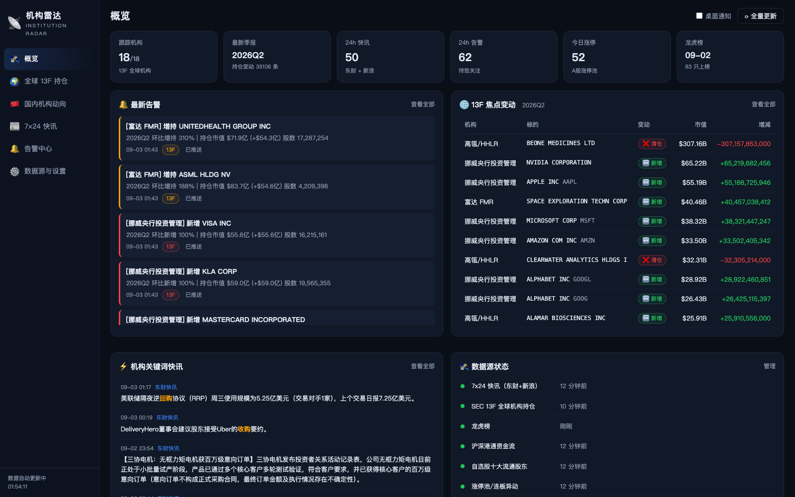
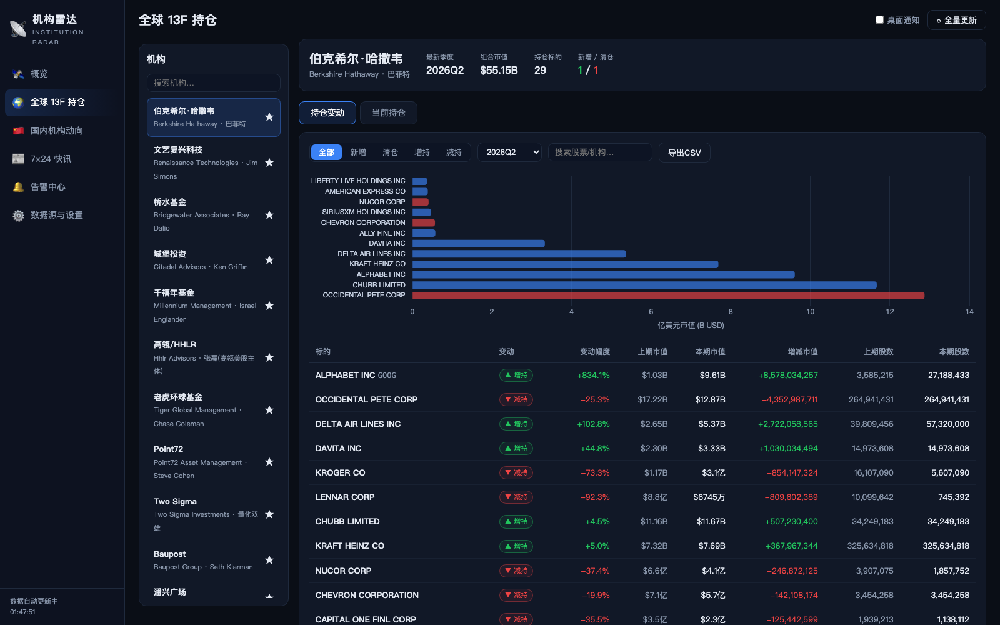
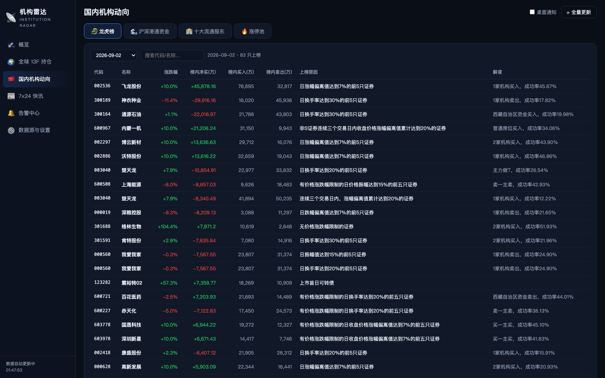

# 机构雷达 · Institution Radar

📡 全球 + 国内主流投资机构的 **持仓变动 + 异动新闻** 监控工具网站。爬虫抓取真实公开数据源，定时自动更新，站内告警 + 桌面通知 + 手机推送。

| 概览 | 全球 13F | 国内动向 |
|:---:|:---:|:---:|
|  |  |  |

## 功能

- **🌍 全球机构 13F 持仓**（SEC EDGAR）：伯克希尔、桥水、文艺复兴、城堡、千禧年、高瓴 HHLR、老虎环球、Point72、Two Sigma、Baupost、潘兴广场、索罗斯、Appaloosa、Elliott、Coatue、孤松、富达、挪威央行 —— 季度持仓、环比变动（新增/清仓/增持/减持）、组合市值、持仓图表、CSV 导出、机构关注
- **🇨🇳 国内机构动向**（东方财富）：龙虎榜、沪深港通资金流（北向净买图表）、自选股十大流通股东（社保/QFII/公募/北向/保险等自动分类）、涨停池连板
- **📰 7×24 快讯**：东方财富 + 新浪财经双源，机构名/动作词自动高亮，"机构命中"过滤
- **🔔 告警提醒**：13F 大变动 / 股东异动 / 关键词快讯三类规则（阈值可调），站内告警中心 + 浏览器桌面通知 + Bark / Server酱 / 飞书 / 钉钉 / 自定义 Webhook 推送
- **⚙️ 数据源管理**：各源启停、更新间隔调整、手动触发、运行状态可视化

## 快速开始

```bash
git clone https://github.com/Roloria/institution-radar.git
cd institution-radar
python3 -m venv .venv
.venv/bin/pip install -r requirements.txt

# 可选：SEC 要求 UA 携带真实联系方式（环境变量配置）
export SEC_UA="YourName your@email.com"

.venv/bin/python app.py          # 或 macOS: 双击 启动机构雷达.command
```

打开 **http://127.0.0.1:8900** —— 首次启动自动建库、种子 18 家机构 + 48 只自选股，并后台全量抓取（13F 约 2 分钟）。

## 自动更新

APScheduler 按数据源配置的间隔定时抓取（快讯 5 分钟、涨停 15 分钟、龙虎榜 30 分钟、沪深港通 60 分钟、十大股东 4 小时、13F 6 小时），全部可在设置页调整/启停。13F 机构 CIK 失效时会经 EDGAR 全文搜索自动修正。

## 配置说明

| 配置 | 默认 | 说明 |
|------|------|------|
| SEC 代理 | `http://127.0.0.1:6152` | SEC EDGAR 需代理访问，可在设置页修改/停用 |
| SEC_UA 环境变量 | 占位符 | SEC 官方要求 UA 标识请求方，建议设置 |
| 告警阈值 | 13F 变动 ≥50% 且市值 ≥$5 亿；股东增减持 ≥5% | 设置页可调 |
| 推送渠道 | 未配置（仅站内） | Bark/Server酱/飞书/钉钉/自定义 webhook |
| 自选股池 | 种子 48 只 A 股 | 「国内动向 → 十大流通股东」页可增删 |

## 架构

```
institution-radar/
├── app.py               # Flask API + SPA 服务 (127.0.0.1:8900)
├── scheduler.py         # APScheduler 自动更新
├── db.py                # SQLite (data/instmon.db)
├── notify.py            # Bark/Server酱/飞书/钉钉/自定义 webhook
├── scrapers/
│   ├── sec13f.py        # SEC EDGAR 13F（走代理，CIK 自愈）
│   ├── eastmoney.py     # 龙虎榜/沪深港通/十大股东/涨停池（直连）
│   ├── news.py          # 东财+新浪 7x24 快讯 + 关键词匹配
│   └── alerting.py      # 告警规则引擎
├── templates/ static/   # 前端 SPA（原生 JS + 本地 Chart.js）
├── scripts/             # 数据源探针 / 冒烟测试
└── docs/                # 截图
```

- 数据库 SQLite（`data/instmon.db`，自动创建，git 忽略）；国内数据源直连，无需代理
- 前端为无构建依赖的原生 JS 单页应用，Chart.js 已本地化，离线可用

## 免责声明

本项目仅聚合公开数据源（SEC EDGAR、东方财富、新浪财经）用于个人研究学习，数据可能有延迟或误差，不构成任何投资建议。请遵守各数据源的服务条款，SEC 请求请按官方要求设置标识 UA 并控制请求频率。
